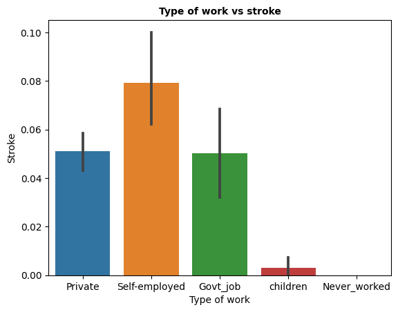
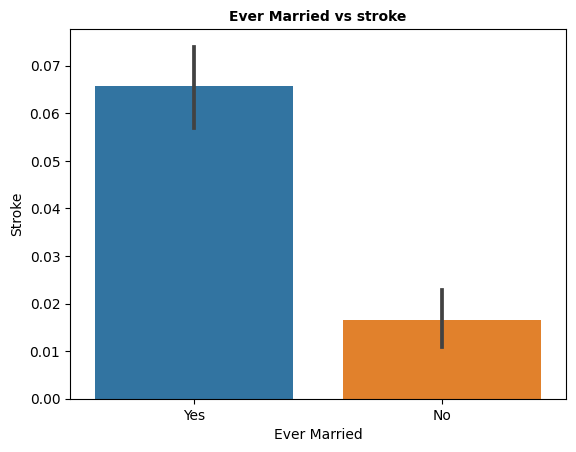
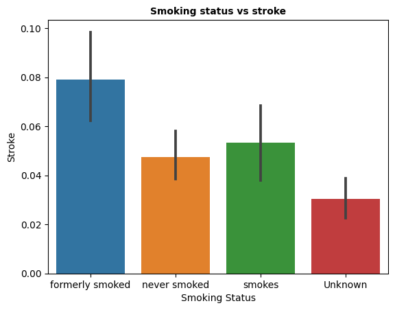

# Prediction of a Stroke
We've been hired by a hospital to determine which profiles of person based on features like age, bmi and heart disease would be able to predict likleyhood of a stroke. We should be able to give them data-driven recommendations on which model would predict the best results.

We will be following the CRISP-DM workflow for our analysis.  

<a href="https://www.datascience-pm.com/crisp-dm-2">Image Source</a>

## Table of Contents

- [Phase 1) Business Understanding](#phase1)
- [Phase 2) Data Understanding](#phase2)
- [Phase 3) Model selection](#phase3)
- [Phase 4) Evaluation](#phase4)

___

# Phase 1) Business Understanding

**Our stakeholders are:**
- Hospitals

**Their primary goal is:**
- Predict the likelyhood of a stroke

**They plan to:**
- Notify patients that are at risk of a stroke

**What do they need/expect?**
- Actionable insights/recommendations for which features they select that would most likely predict a stroke

___

# Phase 2) Data Understanding

## 2.1) What data have we been provided?

The stakeholders have provided us with a data set that contains stroke occorunces:

## 2.2) What information is included in the data?

- The file had 5110 rows and 11 columns.
- There is a mixture of datatypes:
  - 3 float
  - 4 int
  - 5 object
- Since numeric features are sometimes stored as object dtype, we will inspect the object columns next and look for columns that should be converted.

- **Object columns that needed to be removed:**
  - [ ] id - will not stroke prediction
  
  
### **What is the meaning of each feature?**

Variable Name Description 
gender: Sex 
age: Age of person 
hypertension: Whether the person ever had hypertension 
heart_disease: Whether the person ever had Heart disease 
ever_married: Whether the person is married or not 
work_type: the type of job a person has 
residence_type: The type of area the person lives in 
smoking_status: Has the person ever smoked 
stroke: If the person suffered a stroke or not 

## **2.3) How clean is the data?**

### Are there missing values?

Of these columns, 1 seem to have primarily null values ("bmi"). 

#### Null Value Observations:
- "bmi" have a low percentage of null values (3.9%).
- You can impute the values with mean.
  
### Are there duplicate rows?

- No Duplicates

### Are there any features with inconsistent values? (“yes” vs. “Yes”)
- No

#### Categorical Features
**type of work**: 

Shows the Type of work based stroke that has occurred

Shows that if the person is married based stroke that has occurred

#### Ordinal Features

Shows the  smoking status based on stroke occurance

___

# Phase 3) Model selection
 
The tuned Random Forest model would be the recommended model 
The accuracy is calculated at 95%, though this could be improved with further model tuning. 
F1-score is 98%, showing that the tunes models quality is better 
AUC is 82% indicating a very good fit 

___

# Phase 4) Evaluation
 
Baed on the model performance and the data analytics that has been graphed. It is noted that people lving in urban areas are more likely to suffer strokes.  People that are married have a higher likelihood of strokes. 
Recommendation is to move to a Rural area, if pssible.  
Remaining single as long as possible might be good for your health a married people suffer more strokes. 
Do not smoke as smoking contributes to increases the likelihood of a stroke. 

